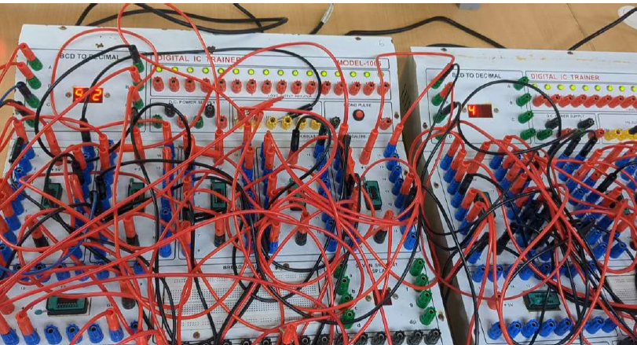
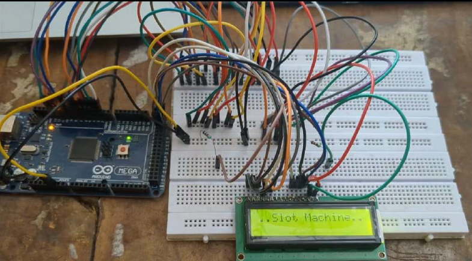

# Electronic Slot Machine

## Overview

The Electronic Slot Machine is a digital electronics project that simulates the functionality
of a traditional slot machine using sequential logic circuits and an Arduino Mega. The system generates 
pseudo-random numbers through counters operating at different frequencies, processes user bets,
calculates payouts based on predefined rules, and displays results on a 16×2 LCD screen.

This project demonstrates the practical application of digital logic design, counter circuits, 
clock frequency control, microcontroller interfacing, and embedded system programming.

## Features

* Pseudo-random number generation using asynchronous counters
* Three independent BCD counters operating at different frequencies for three digit random number generation
* User-defined betting system
* Arduino Mega based payoff calculation
* Real-time result display using 16×2 LCD
* Digital logic and embedded systems integration
* Interactive gaming simulation

## System Architecture

1. Three asynchronous counters generate pseudo-random values.
2. Counter outputs are provided as BCD inputs.
3. User enters a bet value through serial communication.
4. Arduino Mega reads counter values and bet amount.
5. Payoff logic evaluates winning combinations.
6. Results are displayed on a 16×2 LCD module.
   

## Hardware Components

* Arduino Mega 2560
* Digital Trainer Kit
* 74LS193 Counter IC
* 16×2 LCD Display
* Breadboard
* Connecting Wires
* Power Supply

## Software Requirements

* Arduino IDE
* Embedded C/C++
* LiquidCrystal Library

## Payoff Logic

| Condition              | Payoff                 |
| ---------------------- | ---------------------- |
| 000                    | 1000                   |
| Any two zeros          | 200                    |
| All three digits equal | Digit × 50 × (Bet + 1) |
| Any two digits equal   | Digit × 10 × (Bet + 1) |
| No match               | 0                      |

## Working Principle

The slot machine uses three counters running at different clock frequencies to generate continuously changing values.
Due to frequency differences, the generated outputs appear random.

The Arduino Mega reads these values, accepts a user-entered bet, applies predefined payoff rules, and displays the final result on the LCD.

## Results

The system successfully generates pseudo-random outputs using asynchronous counters and accurately computes payoffs using Arduino-based logic. The generated results are displayed in real time on the LCD display.

## Project Outcomes

* Designed frequency-controlled asynchronous counters
* Integrated digital logic circuits with Arduino Mega
* Implemented payoff generation algorithms
* Developed LCD-based user interface
* Validated system performance under different operating conditions

